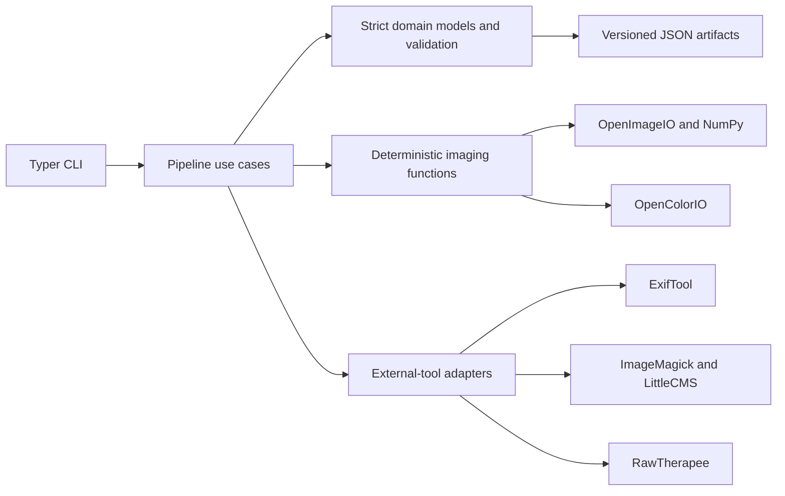
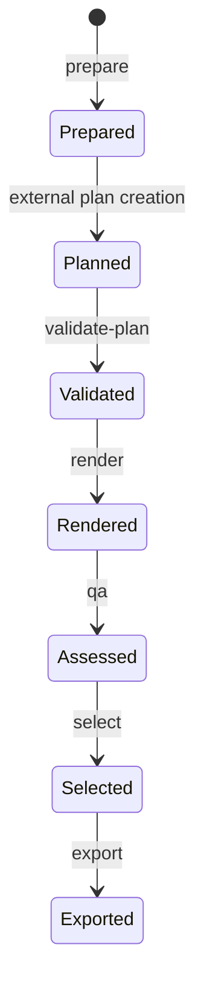

# Architecture

## Component boundaries

CLI code translates arguments and errors. Pipeline use cases own job transitions. Domain code owns schemas, invariants, hashes, and path policy without importing Typer or subprocess modules. Imaging code receives arrays and typed recipes. Adapters receive validated paths and construct fixed command arguments.

## Job lifecycle

Each command validates the manifest and prerequisite artifact hashes before changing state. A command writes new derived artifacts but never edits the source. Conflicting existing artifacts fail unless the command can prove they are identical and reusable.

## Staged processing

JPEG input is oriented and transformed directly to linear ACEScg. Sony ARW input is developed by RawTherapee with isolated settings/cache directories and a copied, hashed PP3; its embedded `RTv4_Large` profile is then transformed to the same ACEScg contract. A recipe applies geometry, global correction, a creative look, an empty local-adjustment stage, crop, output transform, and export encoding. Operations state their units, valid ranges, and processing spaces. Preview and full resolution share this evaluator.

## Edit-plan boundary

Plans contain a schema version, source hash, and exactly three recipes. Each recipe references allowlisted operation fields, a known look ID/version, and a prepared crop ID. Preparation emits crop-artifact schema `2.0.0`: the original frame plus deterministic left/center/right or top/center/bottom anchors for each requested social aspect, using normalized coordinates tied to exact reference-pixel bounds. Pydantic performs structural validation; job-aware validation resolves crop and look references, checks the source hash, loads the working pixels, and requires the prepared crop document to exactly match candidates regenerated from those actual pixel dimensions. Earlier crop schema versions fail with instructions to prepare the job again. Social export validates the aspect purpose only after that geometry and allowlist check rather than privileging a center anchor or trusting editable source metadata or labels. Unknown fields are forbidden. No plan value reaches a shell or becomes a path.

## Data formats

- JSON: UTF-8, canonicalized with sorted keys and compact separators before hashing.
- RAW development output: 16-bit RGB TIFF with the hashed RawTherapee `RTv4_Large` ICC profile.
- Working image: oriented 16-bit RGB TIFF with ACEScg ICC profile.
- Preview and contact sheets: sRGB JPEG with ICC profile.
- Histograms: fixed 256-bin integer arrays.
- Final output: sRGB JPEG with an explicit metadata policy.

## Errors and security

User or validation errors exit with code 2; missing dependencies with 3; processor failures with 4; fatal QA with 5. External tools run without a shell, with explicit timeouts, isolated state directories, safe environment variables, and captured stderr. JPEG input is verified by decoder and signature; ARW input requires its TIFF-based signature plus matching ExifTool type and MIME metadata. Symlinks, path traversal, source/output overlap, unsupported TIFFs, and unprofiled CMYK are rejected.

## Extension points

A replaceable RAW adapter now produces the same working-image contract from an explicit PP3 profile. A future planner consumes current artifacts and emits the same plan contract. Local adjustments may be added only through a new schema version with typed masks in the same post-geometry coordinate system. No current abstraction downloads models or anticipates a UI.

## Versioned global tone and measurement boundary

The edit-plan reader dispatches the explicit `schema_version` to independent version-1 and version-2 Pydantic models. Legacy `CandidateRecipe` pixels retain their old path; `CandidateRecipeV2` adds bounded luminance operators in `grading/tone.py` and a fixed linear-sRGB gamut stage. CLI handlers use the same union validator as render/export. Selection preserves the exact versioned plan rather than inferring a version from candidate fields. Look assets remain separate version-1 definitions.

`apply_recipe` supplies observational callbacks at the global and creative boundaries; pipeline evaluation measures them immediately without retaining full-frame snapshots. `analysis/stages.py` measures every pixel in bounded row tiles and never feeds measurements back into rendering. Output evaluation adds crop/resize, gamut, and preclamp boundaries; JPEG publication reads back actual encoded pixels. QA report version 2 distinguishes all these scopes and records the recipe version and fixed gamut-method identifier. Versioned schemas and examples are generated at preparation; artifact hashes in the existing manifest bind them alongside plan/candidate/export provenance. No API, UI, local mask, or generative path is introduced.
